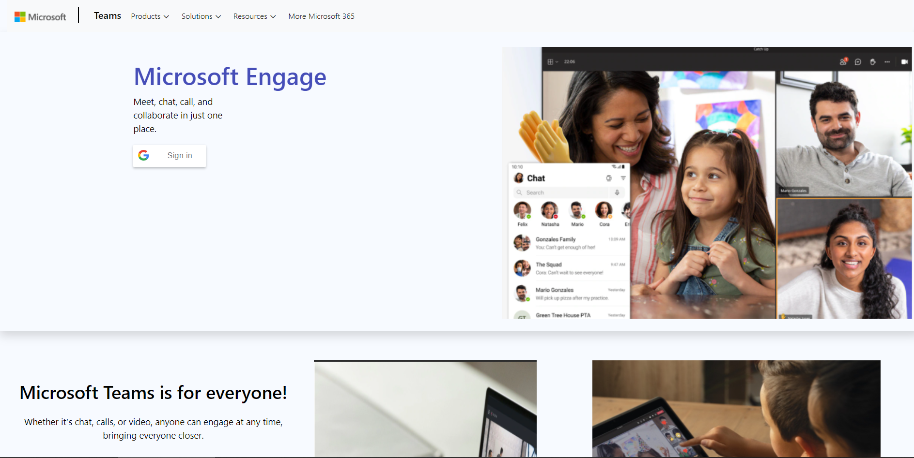

<h1 id="top" align="center"> Microsoft Team Clone</h1>

This is the "Microsoft Team clone" project under the program **Microsoft Engage 2021**. A free WebRTC browser-based video call, chat and screen sharing web app.

<br>


Introduction
------------

The aim of this project is to build  fully functional prototype with at least one mandatory functionality - a minimum of two participants should be able connect with each other using your product to have a video conversation.

## https://engage2021aditya.herokuapp.com/

<br>

[](https://engage2021aditya.herokuapp.com/)

## Features

- `Google Authentication` User can sign in and sign out through its google account
- `Video and Audio Streaming`
- `Video,audio off and  on option`
- `mute other participant` user can be able to mute other other participant 
- `Share room url`Optimized Room Url Sharing (share it to your participants through mail, wait them to join)
- `Screen Share`Screen Sharing to present documents, slides, and more...
- `Unlimited number of conference rooms without call time limitation`
- `Multiple Participant can join the meet at same time`
- `Desktop and Mobile compatible`
- `Recording`Record your Screen and Video
- `Chat` Chat with friends, all partpicant can see the messages also when any participant send the messages all other participant get the `new` in chat icon
- `Full Screen Mode` on click on the expand button on Video element full screen gets enabled
- `Meeting Time` User can see the time for which you they are present in the meeting
- `No download, plug-in entirely browser based`
- `Fully Responsive (Mobile,Desktop ,Any devices)`

## Demo

- `Open`https://engage2021aditya.herokuapp.com/ 
- `Pick` your personal Room name and `Join To Room`
- `Allow` to use the camera and microphone
- `Share` the Room URL and `Wait` someone to join for video conference


## Quick start

- You will need to have [Node.js](https://nodejs.org/en/) installed
- Clone this repo

```bash
git clone https://github.com/aditya20233/microsoft-engage-2021-project.git
```

## Setup Turn

Not mandatory but `recommended`.

- Create an account on http://numb.viagenie.ca
- Get your Account USERNAME and PASSWORD
- Fill in your credentials


## Install dependencies

```js
npm install
```

## Start the server

```js
npm start
```

- Open http://localhost:3000 in browser


## To know more about the projects [click here](https://drive.google.com/file/d/1GxYL9gVBck6uYGer2LmrqhdJZSkbQ0zq/view?usp=sharing)

## References
- https://webrtc.org/getting-started/overview
- https://developers.google.com/identity/sign-in/web/sign-in
- https://developer.mozilla.org/en-US/docs/Web/API/WebRTC_API/Connectivity

